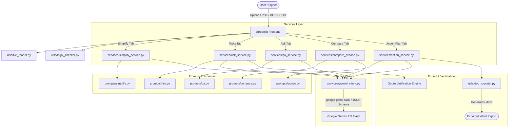

# ⚖️ LegalLens

> An AI-powered legal document assistant that transforms dense, intimidating legal agreements into clear, plain-English summaries, actionable checklists, and risk assessments.

---

## 📌 Problem Statement

Legal agreements—such as residential leases, employment contracts, non-disclosure agreements (NDAs), and terms of service—are ubiquitous yet notoriously difficult to comprehend. 
- **Dense Legalese**: Obscures critical obligations, penalties, and deadlines.
- **Hidden Risks**: Signers often miss unilateral termination rights, aggressive indemnity clauses, or automatic renewal traps.
- **High Cost of Review**: Consulting a qualified lawyer for routine document review is financially inaccessible for many students, tenants, and small business owners.

---

## 💡 Solution

**LegalLens** bridges this gap by acting as an educational, AI-powered reading assistant. It ingests contracts (`.pdf`, `.docx`, `.txt`) and provides:
1. **Plain-English Simplification** at multiple reading levels.
2. **Automated Risk Scoring & Clause Analysis** with verbatim quote verification.
3. **Interactive Document Q&A** with chat history and citation grounding.
4. **Side-by-Side Contract Comparison** to contrast two drafts.
5. **Pre-Signing Action Plans** with exportable Word (`.docx`) reports.

*Note: LegalLens provides legal INFORMATION, never legal advice.*

---

## 🏗️ System Architecture



---

## 🤖 How Gemini is Used in Each Feature

LegalLens leverages Google's **`google-genai` SDK** with **Gemini 3.6 Flash** (`gemini-3.6-flash`), configured with strict JSON schemas, system instructions, and an automatic retry engine:

| Feature | Gemini Functionality | Output Schema / Format | Grounding & Guardrails |
| :--- | :--- | :--- | :--- |
| **Simplify** | `generate_json` | `{ document_type, one_paragraph_summary, key_points, jargon_glossary, reading_level_used }` | Capped at 80-word summary; plain language or "Explain like I'm 15"; multi-language output (English, Hindi, Kannada). |
| **Risks** | `generate_json` | `{ overall_risk_score, inconsistencies, clauses: [{ clause_title, exact_quote, plain_explanation, category, risk_level, why_it_matters, suggested_question_to_ask }] }` | Requires verbatim `exact_quote` extraction; independent quote verification flags any unverified quotes. |
| **Ask (Chat)** | `generate_json` | `{ answer, supporting_quotes, confidence, needs_lawyer }` | Grounded strictly in document text; answers "The document doesn't cover this" for missing terms; suggests lawyer questions. |
| **Compare** | `generate_json` | `{ differences: [{ topic, document_a_says, document_b_says, which_is_more_favorable_to_signer, impact_explanation }], missing_clauses_in_each, overall_recommendation_for_signer }` | Evaluates favorability from the signer's perspective; truncates oversized documents with visible warnings. |
| **Action Plan** | `generate_json` | `{ checklist_before_signing, obligations_and_deadlines, questions_for_a_lawyer, possible_next_steps, documents_to_gather }` | Provides 8–10 tailored questions for an attorney; structures deadlines and responsible parties. |

---

## ✨ Features

- **Document Ingestion**: Supports digital `.pdf`, `.docx`, and `.txt` files with automated text extraction and scanned document detection warnings.
- **Sample Contracts Built-in**: One-click sample rental agreements for single-document analysis and version comparison.
- **Interactive Chat**: Multi-turn Q&A maintaining up to 6 previous messages of conversational context.
- **Quote Verification Engine**: Verifies that quotes extracted by the AI actually exist in the source document to prevent hallucinated clauses.
- **Word Report Export**: Consolidates the summary, risk breakdown, and action plan into a formatted `.docx` file using `python-docx`.
- **In-Session Caching**: Caches analysis results in `st.session_state` to eliminate redundant Gemini API calls.

---

## 🚀 Getting Started

### Prerequisites
- Python 3.11+
- A Google Gemini API Key ([Google AI Studio](https://aistudio.google.com/))

### 1. Clone & Setup Environment
```bash
git clone <repo-url>
cd legallens

# Create and activate virtual environment
python3 -m venv .venv
source .venv/bin/activate

# Install pinned dependencies
pip install -r requirements.txt
```

### 2. Configure Environment Variables
Copy `.env.example` to `.env` and insert your Gemini API key:
```bash
cp .env.example .env
```
Edit `.env`:
```env
GEMINI_API_KEY=your_actual_gemini_api_key_here
GEMINI_MODEL=gemini-3.6-flash
```

### 3. Run the Application
```bash
streamlit run app.py
```
Open **[http://localhost:8501](http://localhost:8501)** in your browser.

---

## 🧪 Running Tests

The test suite runs with `pytest` and mocks all Gemini API calls:
```bash
pytest -v
```

---

## 🐳 Docker & Google Cloud Run Deployment

LegalLens includes a production-ready `Dockerfile` optimized for Google Cloud Run.

### Build and Run Locally with Docker
```bash
# Build Docker image
docker build -t legallens:latest .

# Run container locally
docker run -p 8080:8080 -e GEMINI_API_KEY="your_api_key" legallens:latest
```

### Deploy to Google Cloud Run
```bash
# Set your Google Cloud project
gcloud config set project YOUR_PROJECT_ID

# Build and submit image to Google Artifact Registry
gcloud builds submit --tag gcr.io/YOUR_PROJECT_ID/legallens

# Deploy to Cloud Run
gcloud run deploy legallens \
    --image gcr.io/YOUR_PROJECT_ID/legallens \
    --platform managed \
    --region us-central1 \
    --allow-unauthenticated \
    --set-env-vars GEMINI_API_KEY="your_api_key",GEMINI_MODEL="gemini-3.6-flash"
```

---

## 📸 Screenshots & UI Walkthrough

1. **Document Upload & Sample Loader**: Sidebar file uploader with quick-load buttons for testing rental agreements.
2. **Simplify Tab**: Reading level toggle ("Simple" vs "Explain like I'm 15"), language selector (English, Hindi, Kannada), and expandable jargon glossary.
3. **Risks Tab**: Metric card displaying overall risk score (0–100), risk-level color badges (`🔴 High`, `🟠 Medium`, `🟢 Low`), and quote verification badges.
4. **Ask Tab**: Interactive chat interface with clickable prompt shortcuts (*"Can I terminate early?"*, *"What are my penalties?"*) and supporting quote blocks.
5. **Compare Tab**: Side-by-side comparison table contrasting terms and highlighting which version favors the signer.
6. **Action Plan Tab**: Pre-signing checklist checkboxes, obligations table, questions for counsel, and Word (`.docx`) download button.

---

## 🛡️ Responsible-AI Approach

LegalLens is built around strict safety and responsible AI principles:
- **Legal Information, Never Legal Advice**: Prominent banners at the top of every page and disclaimers on every AI output reinforce educational use.
- **Strict Grounding**: Prompts explicitly forbid inventing laws or extrapolating unwritten clauses. Missing details trigger "not specified in the document".
- **Verbatim Quote Verification**: The system cross-checks every AI-extracted quote against the raw text. Missing or altered quotes are flagged as `⚠️ Unverified Quote`.
- **Automatic Lawyer Escalation**: When topics involve legal strategy or ambiguous legal rights, the assistant flags `needs_lawyer: true` and suggests specific questions for an attorney.
- **In-Session Privacy**: Documents are processed strictly in-memory during the user's active session and are never persisted or stored on servers.

---

## ⚠️ Limitations

- **Scanned Documents**: `pypdf` extracts text from digital PDFs. Scanned image PDFs without OCR text will trigger a warning.
- **Document Length**: Very long documents in the Compare tab are truncated to 30,000 characters with an alert to prevent context degradation.
- **Jurisdictional Nuances**: LegalLens identifies contractual terms as written, but statutory enforceability varies by local jurisdiction and requires licensed legal counsel.
